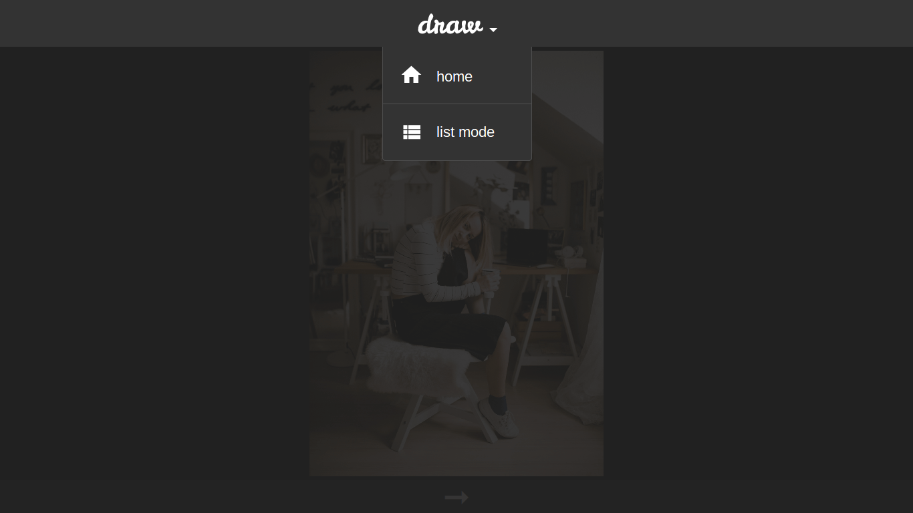

# Draw

A daily selection of reference pictures to focus on drawing practice.

## Demo

[drawdaily.herokuapp.com](https://drawdaily.herokuapp.com/)

## Built With

- Ruby on Rails 5
- RSpec
- Capybara
- Coffeescript
- jQuery
- Unsplash API

See the [Gemfile](Gemfile) for more information.

## Screenshots

<kbd>
  
</kbd>  
&nbsp;
<kbd>
  
</kbd>  
&nbsp;
<kbd>
  
</kbd>  
&nbsp;
<kbd>
  
</kbd>  
&nbsp;
<kbd>
  
</kbd>
